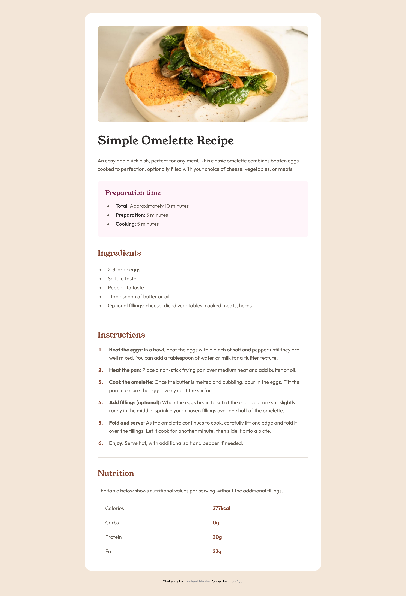
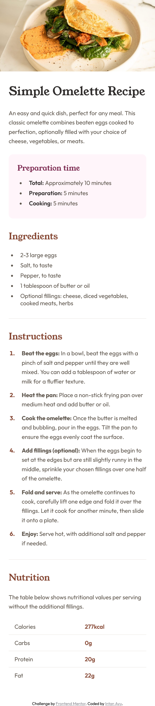

## Overview

### Screenshot

 

### Links

- Solution URL: [Add solution URL here](https://github.com/intan-ayuuu/Frontend-Mentor-Recipe-page-2.git)
- Live Site URL: [Add live site URL here](https://your-live-site-url.com)

## My process

### Built with

- Semantic HTML5 markup
- CSS custom properties
- Flexbox
- Mobile-first workflow

### What I learned

The biggest takeaway from this project was mastering the CSS Box Model. I initially struggled with list items that were pushed too far to the right because I was stacking padding on both the ul and li elements. I learned to use DevTools to debug these "invisible" spacing issues.

I also learned that the <caption> tag must be a direct child of the <table> element for it to be semantically correct and properly styled.

<table>
  <caption>The table below shows nutritional values per serving without the additional fillings.</caption>
  <tbody>
    <tr>
      <th scope="row">Protein</th>
      <td>20g</td>
    </tr>
  </tbody>
</table>

/* Negative margin trick for full-bleed images on mobile */
@media (max-width: 650px) {
  .box-wrapper {
    padding: 24px;
    border-radius: 0;
  }
  .banner img {
    margin: -24px -24px 32px -24px;
    width: calc(100% + 48px);
    border-radius: 0;
  }
}

### Continued development

For my future projects, I plan to focus on:

Responsive Design: Making the transition from desktop to mobile even smoother without relying on "magic numbers."

CSS Precision: Improving my ability to translate a static design into a pixel-perfect layout on the first try.

Semantic HTML: Ensuring my code is as accessible as possible for screen readers and SEO.

### Useful resources

MDN Web Docs: Table - Helped me fix my table structure when the caption was acting up.

Browser DevTools - The ultimate tool for debugging margin/padding overlaps in real-time.

### AI Collaboration

I used Gemini as a collaborative partner to debug and refine this project.

Tools: Gemini.

How I used it: I used the AI to roast my messy initial CSS, explain the Box Model visually via "Inspect Element" descriptions, and brainstorm the best way to handle mobile responsiveness.

What worked well: The AI didn't just give me the answers; it challenged my logic and explained why certain margins were causing layout shifts. This forced me to actually learn the concepts rather than just copying code.

What didn't: Sometimes the AI suggested "pixel-perfect" adjustments that conflicted with my personal preference for the layout, but it served as a great guide.

## Author

- Frontend Mentor - [@intan-ayuuu](https://www.frontendmentor.io/profile/intan-ayuuu)

## Acknowledgments

Big thanks to the AI for being a patient (and brutally honest) mentor. It’s a lot easier to fix a layout when you have a second pair of eyes pointing out that your list markers are floating in the middle of nowhere.
